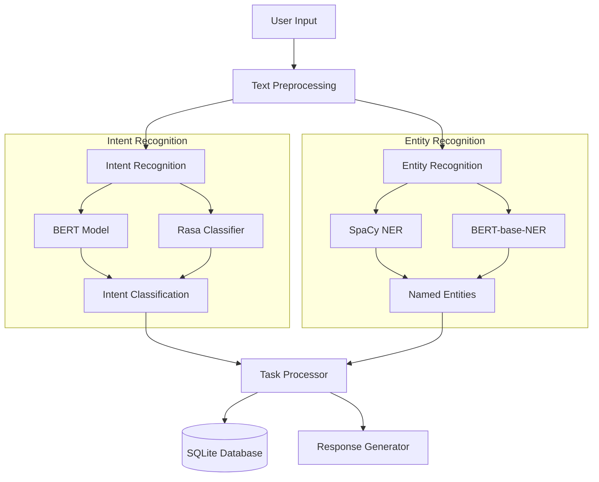
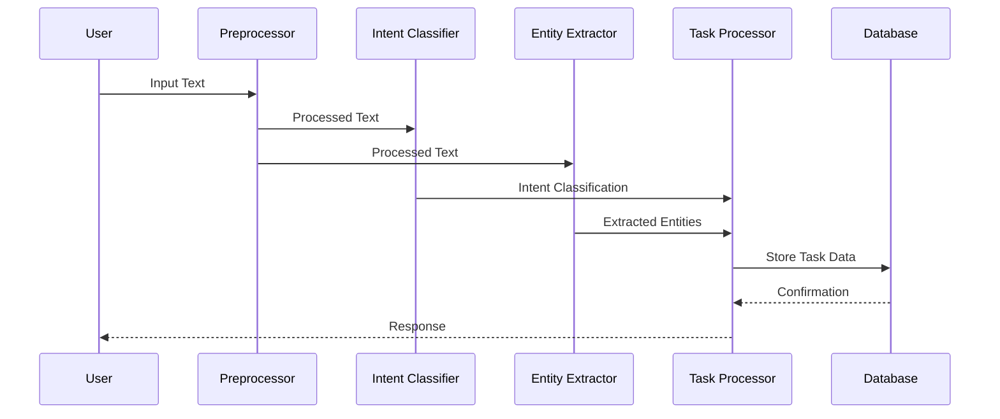
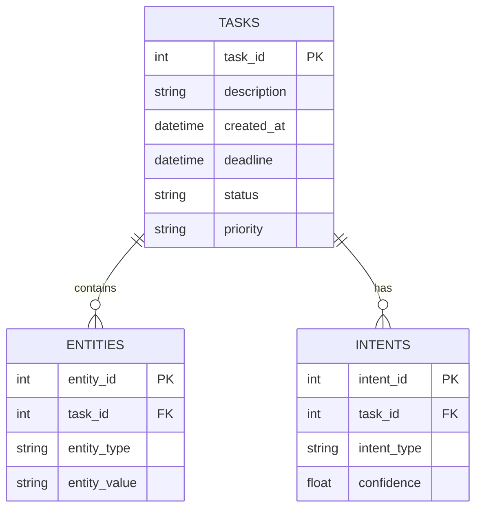

# NLP Models Overview

## Model Architecture



## Model Details

### Text Preprocessing
- Tokenization
- Normalization
- Stop word removal
- Lemmatization

### Intent Recognition Models
1. **BERT Model**
   - Fine-tuned for task classification
   - Handles complex queries
   - Local processing capability

2. **Rasa Classifier**
   - Specialized for intent detection
   - Pattern matching
   - Rule-based classification

### Entity Recognition Models
1. **SpaCy NER**
   - Lightweight and fast
   - Pre-trained on general entities
   - Custom entity training support

2. **BERT-base-NER**
   - Deep learning based
   - Higher accuracy for complex entities
   - Transfer learning capability

### Task Processing


### Database Schema

```mermaid
flowchart LR
    A[User Input] --> B[Intent Recognition]
    B --> C[Entity Recognition]
    C --> D[Task Processing (CRUD Operations)]
    D --> E[Generate Response]
    E --> F[User Output]
    
    style A fill:#f9f,stroke:#333,stroke-width:2px
    style F fill:#f96,stroke:#333,stroke-width:2px
```
