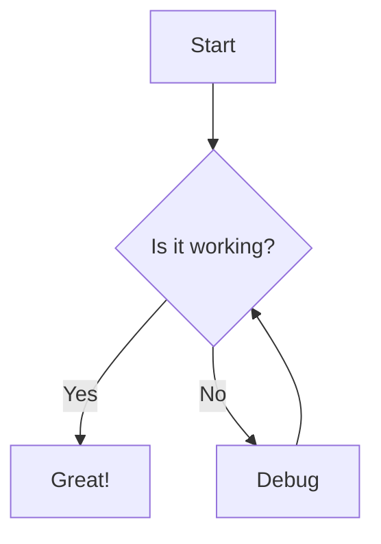
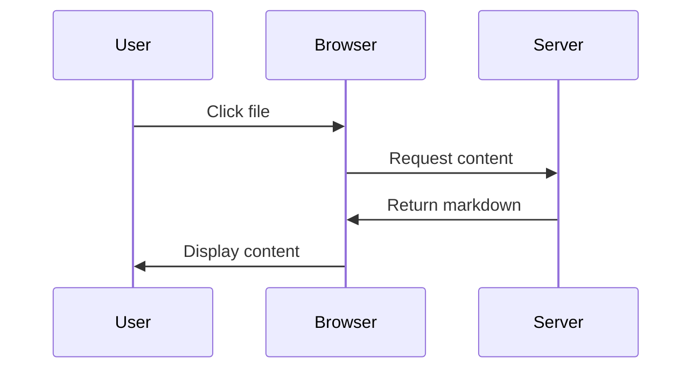

# Mermaid Diagram Test

This is a test of Mermaid diagram rendering.

```mermaid
graph TD
    A[Start] --> B{Is it working?}
    B -- Yes --> C[Great!]
    B -- No --> D[Debug]
    D --> B
```

## Another Example

Here's a sequence diagram:

```mermaid
sequenceDiagram
    participant User
    participant Browser
    participant Server
    
    User->>Browser: Click file
    Browser->>Server: Request content
    Server->>Browser: Return markdown
    Browser->>User: Display content
```

Regular markdown content continues here.
